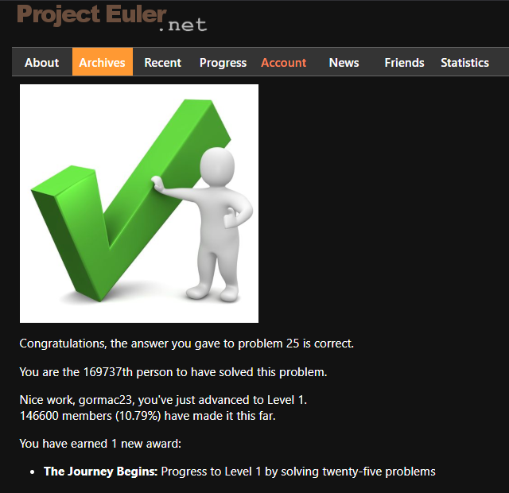

# Project-Euler
Project Euler is a series of challenging mathematical/computer programming problems that will require more than just mathematical insights to solve

So far, I have completed 25 challenges and earned an award:
